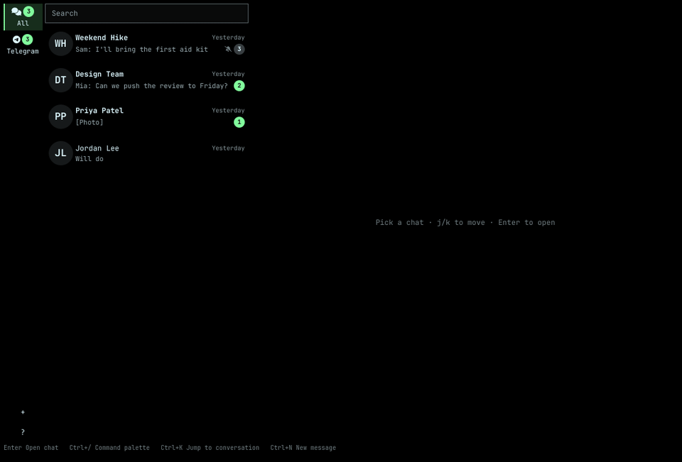

# OmaMessenger

A keyboard-first messaging client for [Omarchy](https://omarchy.org), for Telegram and WhatsApp accounts.



OmaMessenger is an Omarchy plugin. The window runs inside `omarchy-shell`, and Hyprland manages it like any other app; a Go helper it starts handles the messaging underneath.

## Features

- A unified conversation list across every connected account, with a rail to filter by service
- Unread badges, search across every conversation (including archived ones), and older history that loads as you scroll back
- Photos, video and files, with an in-window photo viewer and link previews
- Voice notes play inline, with a scrubber and elapsed/total time; in-window playback needs `qt6-multimedia` (not installed by every Omarchy setup), otherwise a voice message opens in your default player instead
- Replies and reactions; edits sync from the service, and you can delete a message yourself (**d**), for everyone or just for you, as well as have a deletion made elsewhere sync in
- @-mention a group member by typing "@" in the composer; a message that mentions you is highlighted
- Stickers show as static images; sending one is not yet supported
- Pin, archive and a local-only hide, with a one-month recency filter and a "show all" to see everything
- Desktop notifications; click one to open its conversation
- Paste or attach an image to a message
- Keyboard-first, with a command palette (**Ctrl+/**) listing every action and its shortcut
- Light on memory: about 100 MB in use, against about 1 GB for Telegram Desktop and WhatsApp web running side by side

## Install

```sh
omarchy plugin add https://github.com/timlittle/omamessenger --enable
```

The first time you open the window, it downloads and verifies the helper release pinned in `helper-version`, then starts it.

It also adds OmaMessenger to Omarchy's apps menu (**SUPER+ALT+SPACE**). To bind it to a key instead, add a line to `~/.config/hypr/bindings.lua`:

```lua
o.bind("SUPER + ALT + M", "OmaMessenger", "omarchy-shell shell summon io.github.omamessenger '{}'")
```

## Sign in to Telegram

Choose **Add an account** in the window or the command palette. Scan the QR code shown with Telegram (**Settings → Devices → Link Desktop Device**), or choose **Use phone number instead** for a code, and a password if the account has two-step verification. Recent chats sync once it connects.

To sign in with your own Telegram API keys instead of OmaMessenger's, see [docs/telegram.md](docs/telegram.md).

## Sign in to WhatsApp

Choose **Add an account** in the window or the command palette. Scan the QR code shown with WhatsApp (**Settings → Linked devices → Link a device**), or choose **Use phone number instead** and type the 8-character code it shows into WhatsApp. Recent chats sync once it connects; older history beyond what syncs at pairing does not load further back as you scroll, unlike Telegram.

## Keyboard shortcuts

| Keys | Does |
| --- | --- |
| Ctrl+/ | Command palette |
| Ctrl+K | Jump to a conversation |
| Ctrl+Shift+A | Show unread conversations |
| Ctrl+N | New message |
| Ctrl+G | Search messages |
| Enter | Send (while writing) |
| Esc | Step back |
| Ctrl+W | Close the window |
| Ctrl+Q | Quit |

Ctrl+/ lists every command and its shortcut. The full reference, including the conversation list, composer and photo viewer, is in [docs/shortcuts.md](docs/shortcuts.md).

## Data and privacy

The helper stores its data in `${XDG_DATA_HOME:-~/.local/share}/omamessenger/`: `messages.db` (accounts, chats and messages), `telegram/` (each account's session and API keys), `whatsapp/` (each account's session and the media references it needs to download photos and files later) and `media/` (cached photos and files), all `0600`, their directories `0700`.

OmaMessenger is an unofficial Telegram client: it uses Telegram's own API with your account, and Telegram can rate-limit, restrict or ban an account independent of anything OmaMessenger does. WhatsApp support uses an unofficial library ([whatsmeow](https://github.com/tulir/whatsmeow)) the same way, and WhatsApp may similarly restrict or ban an account for using an unofficial client. The helper connects only to the messaging services. It does not log credentials, session keys, phone numbers or message text.

### What OmaMessenger reads, writes and sends

| What | Where | Mode | Why |
| --- | --- | --- | --- |
| Accounts, chats and messages | `$XDG_DATA_HOME/omamessenger/messages.db` | file `0600`, directory `0700` | the local message database |
| Telegram sessions and API keys | `$XDG_DATA_HOME/omamessenger/telegram/` | files `0600`, directory `0700` | signed-in Telegram accounts |
| WhatsApp sessions and media references | `$XDG_DATA_HOME/omamessenger/whatsapp/` | files `0600`, directory `0700` | signed-in WhatsApp accounts |
| Cached photos, video and files | `$XDG_DATA_HOME/omamessenger/media/` | files `0600`, directory `0700` | avoids re-downloading media already seen |
| The installed helper binary | `$XDG_DATA_HOME/omamessenger/bin/` | executable, directory `0700` | the helper release pinned in `helper-version` |
| Plugin source (this checkout) | `~/.config/omarchy/plugins/io.github.omamessenger/` | as installed, read-only at runtime | the QML UI and manifest Omarchy loads; no session or message data is ever written here |
| Apps menu entry | `~/.local/share/applications/io.github.omamessenger.desktop` | `0644`, no secrets | lets Omarchy's menu and **SUPER+ALT+SPACE** open OmaMessenger |
| Network requests | Telegram's and WhatsApp's own servers; `github.com/timlittle/omamessenger/releases` only to download the helper the first time the window opens | — | no other network access |
| Diagnostics | stderr, which `omarchy-shell` sends to the system journal | — | states, counts and safe categories only, never credentials, QR tokens, session keys, phone numbers or message text |

Run `oma-messenger-service doctor`, or **Run health check** in the command palette, to check the data directory's permissions, the database, the media cache, each account's connection and notify-send availability without exposing any of their contents: every line it prints is a state or a category, never a path, a count, a name or a token.

WhatsApp chats show the recent history your phone syncs when you link the device; scrolling back further than that is not currently supported, unlike Telegram, which loads more on demand.

Removing an account (**Remove an account** in the command palette) signs it out and deletes its session and messages from this computer. It does not touch your chat history on the service or on other devices.

## Uninstall

```sh
omarchy plugin remove io.github.omamessenger
rm -rf ~/.local/share/omamessenger
rm -f ~/.local/share/applications/io.github.omamessenger.desktop
```

Also remove any `o.bind(...)` line you added to `~/.config/hypr/bindings.lua`.

## Helper API

The window talks to the helper over its stdin and stdout with JSON-RPC 2.0, one JSON object per line. The method and event reference is in [docs/api.md](docs/api.md).

## Development

See [CONTRIBUTING.md](CONTRIBUTING.md) for the development setup and contribution process, and [AGENTS.md](AGENTS.md) for the project rules.

## License

OmaMessenger's own source is MIT, see [LICENSE](LICENSE). The helper binary built for releases also includes GPL-3.0 code (libsignal, used for WhatsApp's encryption), so release binaries are distributed under GPL-3.0, see [LICENSE-GPL-3.0](LICENSE-GPL-3.0). Third-party notices for everything the helper links are in `THIRD_PARTY_NOTICES`, next to the binary in each release.
