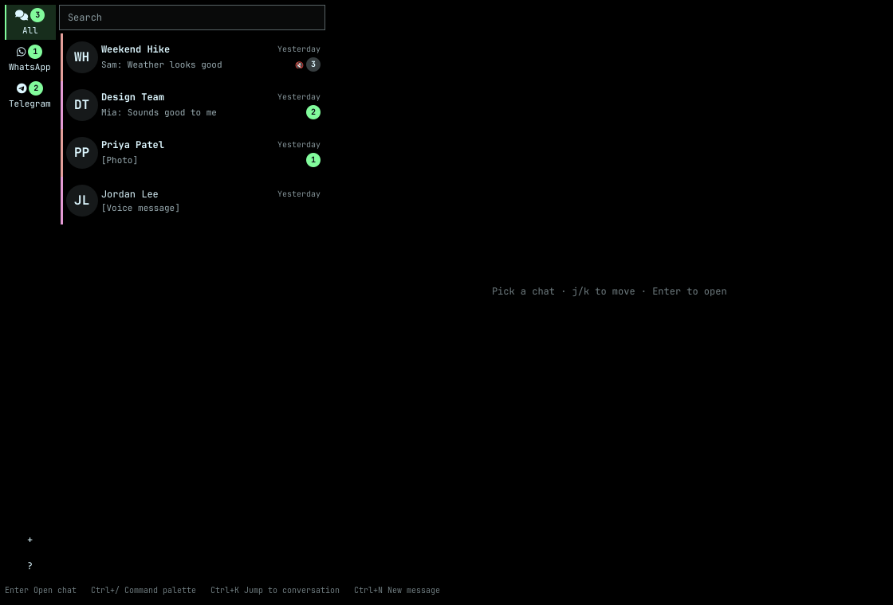

# OmaMessenger

A keyboard-first messaging client for [Omarchy](https://omarchy.org), for Telegram and WhatsApp accounts.



OmaMessenger is an Omarchy plugin. The window runs inside `omarchy-shell`, and Hyprland manages it like any other app; a Go helper it starts handles the messaging underneath.

Short clips of each feature are in [docs/demo.md](docs/demo.md).

## Features

- One conversation list across every Telegram and WhatsApp account, filtered by service from the rail
- Keyboard-first: every action has a shortcut, and **Ctrl+/** lists them all
- Search across every conversation with **Ctrl+K**, and an unread view with **Ctrl+Shift+A**
- Photos, video, files, voice notes, link previews, replies, reactions, polls and @-mentions
- Pin, archive, hide and snooze conversations; failed sends retry themselves
- Desktop notifications, and read receipts you can turn off
- About 120 MB in use, against about 2 GB for Telegram Desktop and WhatsApp Web together ([benchmark](docs/BENCHMARK.md))

## Install

```sh
omarchy plugin add https://github.com/timlittle/omamessenger --enable
```

The first time you open the window, it downloads and verifies the helper release pinned in `helper-version`, then starts it.

Voice notes play in the window when `qt6-multimedia` is installed; without it, they open in your default player.

It also adds OmaMessenger to Omarchy's apps menu (**SUPER+ALT+SPACE**). To bind it to a key instead, add a line to `~/.config/hypr/bindings.lua`:

```lua
o.bind("SUPER + ALT + M", "OmaMessenger", "omarchy-shell shell summon io.github.omamessenger '{}'")
```

## Sign in to Telegram

Choose **Add an account** in the window or the command palette. Scan the QR code shown with Telegram (**Settings → Devices → Link Desktop Device**), or choose **Use phone number instead** for a code, and a password if the account has two-step verification. Recent chats sync once it connects.

To sign in with your own Telegram API keys instead of OmaMessenger's, see [docs/telegram.md](docs/telegram.md).

## Sign in to WhatsApp

Choose **Add an account** in the window or the command palette. Scan the QR code shown with WhatsApp (**Settings → Linked devices → Link a device**), or choose **Use phone number instead** and type the 8-character code it shows into WhatsApp. Recent chats sync once it connects; scrolling back further asks your phone for more, so it needs to be online and reachable. If it is not, a note says so at the top of the conversation — try again once it is.

## Keyboard shortcuts

| Keys | Does |
| --- | --- |
| Ctrl+/ | Command palette |
| Ctrl+K, Ctrl+G | Jump to a conversation or search messages, in one palette |
| Ctrl+Shift+A | Show unread conversations |
| Ctrl+N | New message |
| Enter | Send (while writing) |
| Esc | Step back |
| Ctrl+W | Close the window |
| Ctrl+Q | Quit |

Ctrl+/ lists every command and its shortcut. The full reference, including the conversation list, composer and photo viewer, is in [docs/shortcuts.md](docs/shortcuts.md). To remap a shortcut, see [docs/shortcuts.md](docs/shortcuts.md#remapping-keys) for `~/.config/omamessenger/keys.conf`, or run `make keys` to print the effective bindings for a bug report.

## Data and privacy

Accounts, sessions and messages stay on this computer, in `${XDG_DATA_HOME:-~/.local/share}/omamessenger/`, readable only by you. The helper talks only to Telegram's and WhatsApp's servers, and to GitHub once to download itself. Both connections are unofficial clients, which the services can restrict. Details, including every file it writes, are in [docs/privacy.md](docs/privacy.md).

## Uninstall

```sh
omarchy plugin remove io.github.omamessenger
rm -rf ~/.local/share/omamessenger
rm -f ~/.local/share/applications/io.github.omamessenger.desktop
```

Also remove any `o.bind(...)` line you added to `~/.config/hypr/bindings.lua`.

## Development

See [CONTRIBUTING.md](CONTRIBUTING.md) for the development setup and contribution process, [AGENTS.md](AGENTS.md) for the project rules, and [docs/api.md](docs/api.md) for the helper's JSON-RPC API.

## License

OmaMessenger's own source is MIT, see [LICENSE](LICENSE). The helper binary built for releases also includes GPL-3.0 code (libsignal, used for WhatsApp's encryption), so release binaries are distributed under GPL-3.0, see [LICENSE-GPL-3.0](LICENSE-GPL-3.0). Third-party notices for everything the helper links are in `THIRD_PARTY_NOTICES`, next to the binary in each release.
