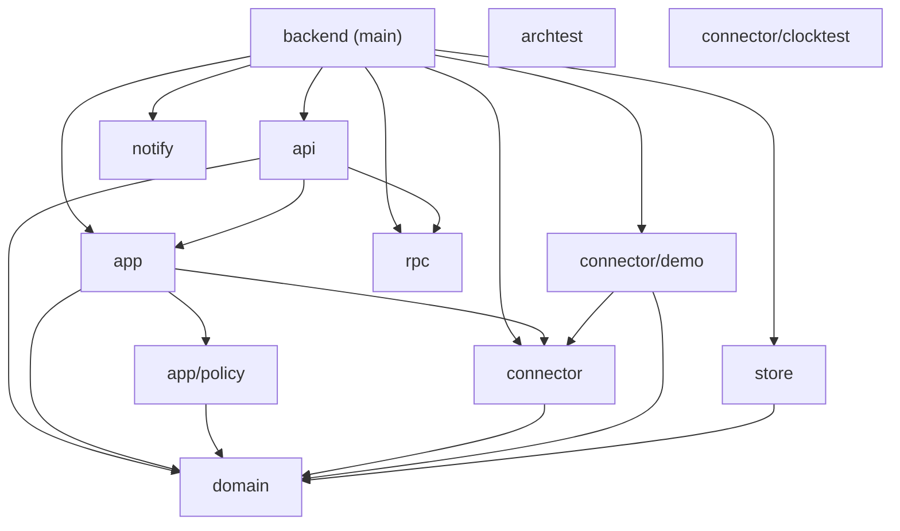

# Backend architecture

Generated from `backend/internal/archtest`. Run `go test -mod=vendor ./backend/internal/archtest -args -update` after changing package dependencies or structs.

| package | Ca | Ce | I | A | distance | LCOM4 |
|---|---:|---:|---:|---:|---:|---|
| `backend (main)` | 0 | 7 | 1.00 | 0.00 | 0.00 | Config:0, discardWriter:1 |
| `api` | 1 | 3 | 0.75 | 1.00 | 0.75 | — |
| `app` | 2 | 3 | 0.60 | 0.19 | 0.21 | Commands:1, Config:0, ContactsListParams:0, ConversationParams:0, ConversationsListParams:0, FocusParams:0, HelloResult:0, Ingest:1, InjectParams:0, MessagesListParams:0, MessagesListResult:0, OpenConversationParams:0, RetryParams:0, SendMessageParams:0, SetMutedParams:0, SettingsParams:0, publisher:1, session:1, settings:0, typingEvent:0, unreadEvent:0 |
| `app/policy` | 1 | 1 | 0.50 | 0.00 | 0.50 | Input:0 |
| `archtest` | 0 | 0 | 0.00 | 0.00 | 1.00 | — |
| `connector` | 3 | 1 | 0.25 | 0.71 | 0.04 | Manager:1, RealClock:2, connectionState:1, trackedSink:1 |
| `connector/clocktest` | 0 | 0 | 0.00 | 0.00 | 1.00 | Clock:1, timer:0 |
| `connector/demo` | 1 | 2 | 0.67 | 0.00 | 0.33 | Injector:1, accountScript:0, conversationScript:1, demoConnector:1, suite:0 |
| `domain` | 6 | 0 | 0.00 | 0.00 | 1.00 | Account:0, Contact:0, Conversation:0, Message:0 |
| `notify` | 1 | 0 | 0.00 | 0.00 | 1.00 | Desktop:1 |
| `rpc` | 2 | 0 | 0.00 | 0.00 | 1.00 | Stream:1, event:0, protocolError:0, request:0, response:0, session:1 |
| `store` | 1 | 1 | 0.50 | 0.00 | 0.50 | Store:1 |
